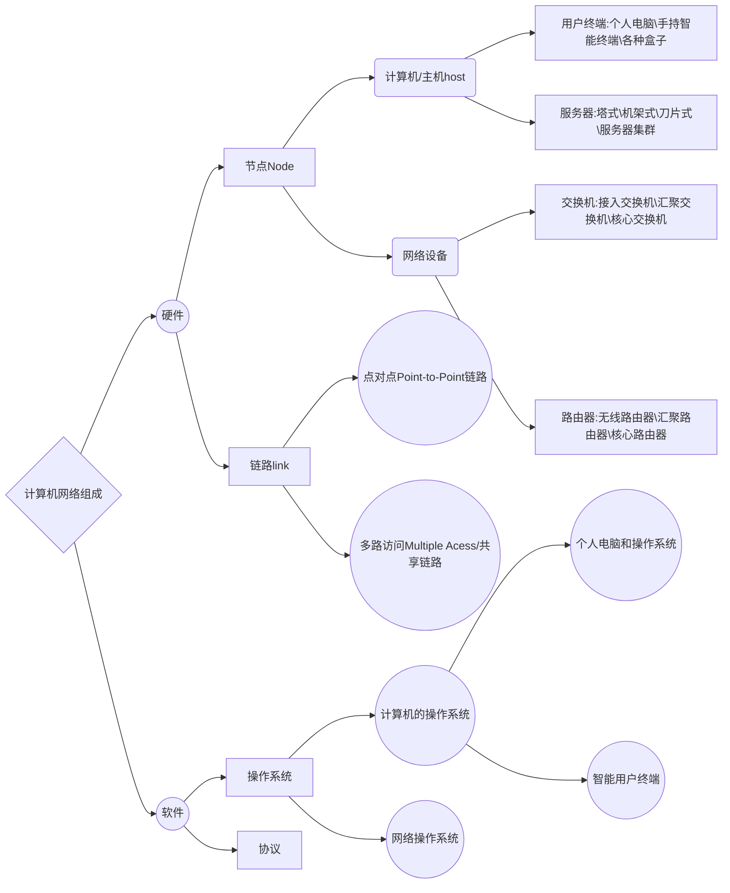

# 课前须知

## 课程主页
> http://if.ustc.edu.cn/course/

## 评分
> - [x] 平时成绩(作业，平时考勤，课堂训练)20%
> - [x] 实验20%
> - [x] 期末考试(闭卷)60%

## 计算机网络技术
1. 数据打包
2. 传输数据
3. 协议：接入链路(连上网络)、寻址路由(知道服务器在哪如何到达)、传输控制(保证可靠)、网络安全(保证安全)

## 计算机网络的一些基本概念

### 计算机网络起源
- [x] 1946年，世界上第一台通用电子计算机ENIAC(人们直接在机房中使用计算机编程)
- [x] 1954年，发明了被称为收发器(transceiver)的终端机(人们通过终端机将命令发给计算机，计算机处理后将结果返回给终端)
- [x] 远程联机系统——计算机网络的雏形

### 计算机网络构建
- [x] 方式一：直接连接(直接连接成本太高，而且线路利用率低)(也就是字面意义上的两个终端直连)。
- [x] 方式二：通过交换机进行复用，形成交换网。
    > 交换机：实现线路复用，为两个非直接相连的设备提供数据转发(注：交换机的概念非常广泛，路由器也可以看作是一种交换机)
- [x] 方式三：通过路由器和交换机形成更加复杂的网络。
    > 路由：如何为相隔多个网络的两个通信节点找到数据转发路径，执行路由操作的交换机通常被称为路由器

#### 路由过程

	 
	 
路由过程

> Router：路由器  OSPF/BGP：路由协议 RIB：路由信息表，或者叫路由表
- [x] 路由过程在示例网络中的交互。每个路由过程由存储其路由的RIB表示。虚线表示路由的导入、导出和重新分发。接口用标识符标记，接口之间的实线表示物理链路。

#### 交换机/路由器架构

	 
	 
交换结构

> 控制处理器管理交换机和执行更高级别的协议。例如路由、管理等。交换结构将流量引导到正确的输出端口。输入和输出端口处理数据包的传输和接收。

### 计算机网络组成
- [x] 计算机网络组成如下:
  

- [x] 链路(link):连接两个或者多个节点的物理介质。
- [x] 操作系统:对节点上的资源进行管理，为软件提供运行环境。
- [x] 协议:定义了节点间的通信规则，具体包括信息格式，交互流程，解释处理。
    > 为了能听得“懂”对方，节点上需要运行事先定义的协议来实现一些功能，包括信息怎么样解释和处理、怎么样传输等
- [x] 网络操作系统：
    > 1. Cisco:IOS(Internetwork OS)
    > 2. 华为:VRP

### 计算机网络定义(定义不会考，因为怎么说都有理)
> (书上的定义)大量相互独立但彼此连接的计算机共用完成计算任务，这些系统被称为 ***计算机网络***。
- [x] (PPT上的定义)定义为一系列计算机、链路和网络设备的集合，并且满足
    > 1. 物理上：链路和网络设备将计算机连接起来，确保拓扑上的连通性
    > 2. 功能上：提供数据传输功能，确保计算机之间能够交换数据
- [x] 通过计算机网络，将实现
    > 1. 信息服务：web服务、即时通信、在线视频等等
    > 2. 资源共享：打印/复印/扫描、云存储、云计算等等
- [x] 计算机网络的通用性
    > 1. 通过在计算机上运行软件实现各种网络应用
    > 2. 能够传输文件、话音、视频、图像等多种类型数据
- [x] 如果两台计算机能够交换信息，则称两台计算机是 ***相互链接的***。

### 计算机网络与互连网
- [x] 一些独立的计算机网络互相连接形成互连网(internet)
    > 连接两个或者多个计算机网络的节点被称为路由器(Router)
- [x] 将互连网看作是一种类型的网络，通过网络嵌套可以构成任意规模的互连网
- [x] 为了叙述方便，我们将任意规模的互连网简称为网络(networks)

### 计算机网络与Internet
- [x] Internet(因特网)是世界上最大的计算机网络(注意: ***此处大小写的意义是截然不同的***)
    > 起源于美国的ARPANET(dvanced Research Projects Agency Network)，早期的ARPANET包括后来的NSFNET，主要由各个科研机构的计算机互连而成
    > 当前商业化的Internet由不同网络服务提供商(ISP：Internet Service Provider)的网络互连而成，理论上，用户设备和网络只要运行TCP/IP协议，都可以通过ISP接入到Internet

### internet和Internet
- [x] internet: 互 `连` 网，由多个计算机网络互连而成，在这些网络之间的通信协议可以是任意的
- [x] Internet：因特网或者互 `联` 网，由数量庞大的各种类型网络互连而成，这些网络都运行TCP/IP协议族
    > 1. 由ARPANET发展而来
    > 2. 世界上最大的互连网

## 课程目标
- [x] 掌握计算机网络中的基本概念
- [x] 了解如何构建一个网络
    > 关注为应用提供数据传输服务的网络体系结构，而不是应用本身
- [x] 掌握基本的网络操作
    > 网络配置
    >
    > 网络编程

> Internet是世界上最大、最成功、应用最广泛的计算机网络，本课程主要内容围绕着Internet展开，关注应用于Internet的计算机网络技术

# 第一章 概述(略)

## 1.1 国际Internet的发展史
- [x] 第一阶段(1969-1985)：ARPANET(一直到1990年才关闭)，进行各种网络技术的实验
    > 1983年，TCP/IP协议成为ARPANET上的标准协议，因此人们把1983年称为Internet的诞生时间
    >
    > 1984年，域名系统(DNS)引入，主机数量突破1000台
- [x] 第二阶段(1986-1992)：NSFNET，教学科研，后期开始商业化， 1995年，重新成为科研网络
    > 1986年，NSFNET诞生
    > 1991年，WWW由CERN 公开发布
- [x] 第三阶段(1993-  )：商业化的Internet，主要由ISP(Internet Service Provider)的网络互连而成
    > 1998年，IPv6标准正式发布
- [x] 第四阶段(2005-  )：未来Internet，研究阶段，各试验网已经开始部署
    > 2005年，美国NSF启动GENI(Global Environment for Networking Innovation)和FIND(Future INternet Design)
    >
    > 2010年，美国启动FIA（Future Internet Architecture Program)
    >
    > 2018年，ITU-T成立网络2030焦点组(FG-NET-2030：Focus Group on Network 2030)

## 1.2 中国Internet的发展史

## 1.3 IPv6发展史

## 1.4 网络体系结构

## 1.5 网络标准化

## 1.6 网络性能度量

