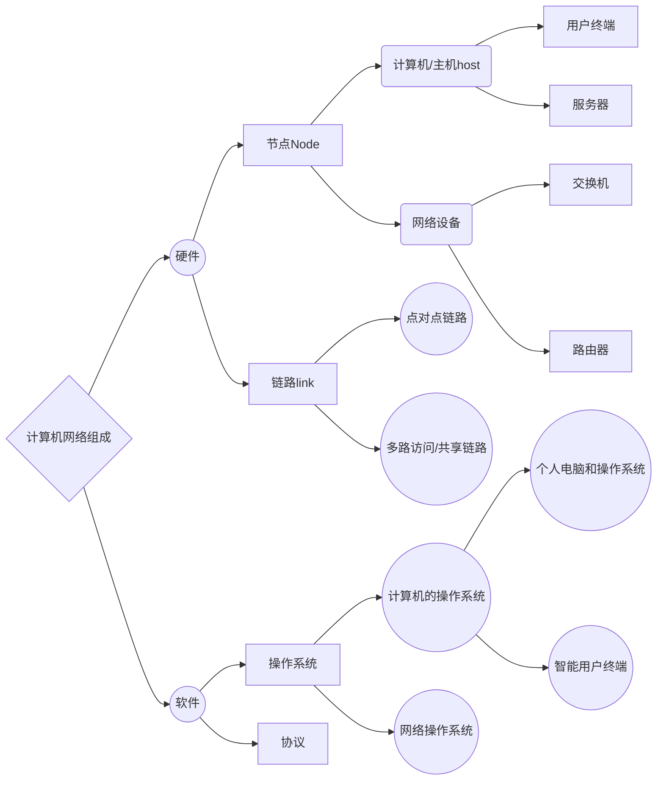

# 课前须知

## 课程主页
> http://if.ustc.edu.cn/course/

## 评分
> - [x] 平时成绩（作业，平时考勤，课堂训练）20%
> - [x] 实验20%
> - [x] 期末考试（闭卷）60%

## 前沿介绍
> 大量相互独立但彼此连接的计算机共用完成计算任务，这些系统被称为 ***计算机网络***。
- 如果两台计算机能够交换信息，则称两台计算机是 ***相互链接的***。
- 计算机网络组成如下:

> 链路（link）:连接两个或者多个节点的物理介质。
>
> 操作系统:对节点上的资源进行管理，为软件提供运行环境。
>
>协议:定义了节点间的通信规则，具体包括信息格式，交互流程，解释处理。
>
>  网络操作系统：
> > 1. Cisco:IOS（Internetwork OS）
> > 2. 华为:VRP

- - -
# 第一章 概述
(定义不会考)
