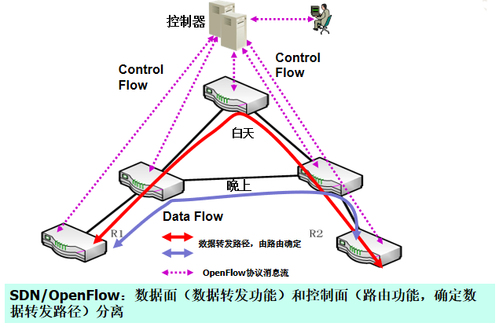
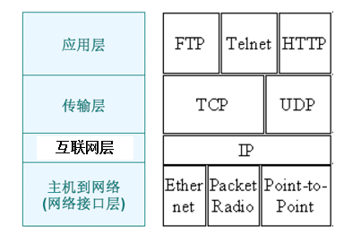
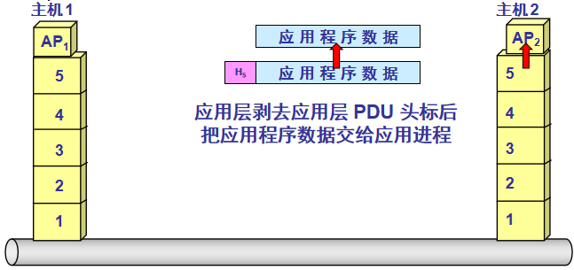

# 课前须知

## 课程主页
> http://if.ustc.edu.cn/course/

## 评分
> - [x] 平时成绩(作业，平时考勤，课堂训练)20%
> - [x] 实验20%
> - [x] 期末考试(闭卷)60%

## 计算机网络技术
1. 数据打包
2. 传输数据
3. 协议：接入链路(连上网络)、寻址路由(知道服务器在哪如何到达)、传输控制(保证可靠)、网络安全(保证安全)

## 计算机网络的一些基本概念

### 计算机网络起源
- [x] 1946年，世界上第一台通用电子计算机ENIAC(人们直接在机房中使用计算机编程)
- [x] 1954年，发明了被称为收发器(transceiver)的终端机(人们通过终端机将命令发给计算机，计算机处理后将结果返回给终端)
- [x] 远程联机系统——计算机网络的雏形

### 计算机网络构建
- [x] 方式一：直接连接(直接连接成本太高，而且线路利用率低)(也就是字面意义上的两个终端直连)。
- [x] 方式二：通过交换机进行复用，形成交换网。
    > 交换机：实现线路复用，为两个非直接相连的设备提供数据转发(注：交换机的概念非常广泛，路由器也可以看作是一种交换机)
- [x] 方式三：通过路由器和交换机形成更加复杂的网络。
    > 路由：如何为相隔多个网络的两个通信节点找到数据转发路径，执行路由操作的交换机通常被称为路由器

#### 路由过程

	 
	 
路由过程

> Router：路由器  OSPF/BGP：路由协议 RIB：路由信息表，或者叫路由表
- [x] 路由过程在示例网络中的交互。每个路由过程由存储其路由的RIB表示。虚线表示路由的导入、导出和重新分发。接口用标识符标记，接口之间的实线表示物理链路。

#### 交换机/路由器架构

	 
	 
交换结构

> 控制处理器管理交换机和执行更高级别的协议。例如路由、管理等。交换结构将流量引导到正确的输出端口。输入和输出端口处理数据包的传输和接收。

### 计算机网络组成
- [x] 计算机网络组成如下:
  

- [x] 链路(link):连接两个或者多个节点的物理介质。
- [x] 操作系统:对节点上的资源进行管理，为软件提供运行环境。
- [x] 协议:定义了节点间的通信规则，具体包括信息格式，交互流程，解释处理。
    > 为了能听得“懂”对方，节点上需要运行事先定义的协议来实现一些功能，包括信息怎么样解释和处理、怎么样传输等
- [x] 网络操作系统：
    > 1. Cisco:IOS(Internetwork OS)
    > 2. 华为:VRP

### 计算机网络定义(定义不会考，因为怎么说都有理)
> (书上的定义)大量相互独立但彼此连接的计算机共用完成计算任务，这些系统被称为 ***计算机网络***。
- [x] (PPT上的定义)定义为一系列计算机、链路和网络设备的集合，并且满足
    > 1. 物理上：链路和网络设备将计算机连接起来，确保拓扑上的连通性
    > 2. 功能上：提供数据传输功能，确保计算机之间能够交换数据
- [x] 通过计算机网络，将实现
    > 1. 信息服务：web服务、即时通信、在线视频等等
    > 2. 资源共享：打印/复印/扫描、云存储、云计算等等
- [x] 计算机网络的通用性
    > 1. 通过在计算机上运行软件实现各种网络应用
    > 2. 能够传输文件、话音、视频、图像等多种类型数据
- [x] 如果两台计算机能够交换信息，则称两台计算机是 ***相互链接的***。

### 计算机网络与互连网
- [x] 一些独立的计算机网络互相连接形成互连网(internet)
    > 连接两个或者多个计算机网络的节点被称为路由器(Router)
- [x] 将互连网看作是一种类型的网络，通过网络嵌套可以构成任意规模的互连网
- [x] 为了叙述方便，我们将任意规模的互连网简称为网络(networks)

### 计算机网络与Internet
- [x] Internet(因特网)是世界上最大的计算机网络(注意: ***此处大小写的意义是截然不同的***)
    > 起源于美国的ARPANET(dvanced Research Projects Agency Network)，早期的ARPANET包括后来的NSFNET，主要由各个科研机构的计算机互连而成
    > 当前商业化的Internet由不同网络服务提供商(ISP：Internet Service Provider)的网络互连而成，理论上，用户设备和网络只要运行TCP/IP协议，都可以通过ISP接入到Internet

### internet和Internet
- [x] internet: 互 `连` 网，由多个计算机网络互连而成，在这些网络之间的通信协议可以是任意的
- [x] Internet：因特网或者互 `联` 网，由数量庞大的各种类型网络互连而成，这些网络都运行TCP/IP协议族
    > 1. 由ARPANET发展而来
    > 2. 世界上最大的互连网

## 课程目标
- [x] 掌握计算机网络中的基本概念
- [x] 了解如何构建一个网络
    > 关注为应用提供数据传输服务的网络体系结构，而不是应用本身
- [x] 掌握基本的网络操作
    > 网络配置
    >
    > 网络编程

> Internet是世界上最大、最成功、应用最广泛的计算机网络，本课程主要内容围绕着Internet展开，关注应用于Internet的计算机网络技术

# 第一章 概述(略)

## 1.1 国际Internet的发展史
- [x] 第一阶段(1969-1985)：ARPANET(一直到1990年才关闭)，进行各种网络技术的实验
    > 1983年，TCP/IP协议成为ARPANET上的标准协议，因此人们把1983年称为Internet的诞生时间
    >
    > 1984年，域名系统(DNS)引入，主机数量突破1000台
- [x] 第二阶段(1986-1992)：NSFNET，教学科研，后期开始商业化， 1995年，重新成为科研网络
    > 1986年，NSFNET诞生(三级网络结构，第一层主干网(Backbone)，第二层地区网(Regional)，第三层为企业网...校园网)
    > 
    > 1991年，WWW由CERN 公开发布
- [x] 第三阶段(1993-  )：商业化的Internet，主要由ISP(Internet Service Provider)的网络互连而成
    > 1998年，IPv6标准正式发布
    >
    > _**根据提供服务的覆盖面积大小以及所拥有的IP 地址数目的不同，ISP 也分成为不同的层次。**_
    >
    > 采用三层ISP网络结构的Internet

	 
	 
采用三层ISP网络结构的Internet

- [x] 第四阶段(2005-  )：未来Internet，研究阶段，各试验网已经开始部署
    > 2005年，美国NSF启动GENI(Global Environment for Networking Innovation)和FIND(Future INternet Design)
    >
    > 2010年，美国启动FIA（Future Internet Architecture Program)
    >
    > 2018年，ITU-T成立网络2030焦点组(FG-NET-2030：Focus Group on Network 2030)

### 软件定义网络(SDN)
- [x] SDN/OpenFlow：OpenFlow是SDN的一种实现形式，通过面向用户的集中式的控制器来对网络流量进行更加灵活高效的控制，及时满足用户或者应用的需求。

	 
	 
SDN/OpenFlow

### 未来Internet体系架构研究

#### NSF
- [x] NSF未来互联网架构计划
> 成立于2010年，面向未来15年的设计
>	
> 项目
> > - [ ] 命名数据定义网络(Named Data Networking)(内容寻址，属于信息中心网络)
> > - [ ] MobilityFirst(解决移动性问题)
> > - [ ] NEBULA
> > - [ ] eXpressive互联网架构
> > - [ ] ChoiceNet

- [x] 基本特征：除了数据传输，网络具有更多的能力，例如计算、存储等，而且网络更加灵活，例如可编程等

#### Network 2030(ITU-T FG-NET-2030)
- [x] 新媒体传输技术
- [x] 新网络服务和应用及其使能技术
- [x] 新网络架构及其演进

#### GENI
- [x] GENI(Global Environment for Network Innovations)
	> 用于大规模网络和分布式系统研究和教育的开放体系架构，以支持网络科学、安全、服务和应用的创新
	>
	> 实验者可以
	> > 获取计算资源，建立试验网络
	> >
	> > 在试验网络内安装软件甚至OS，运行和测试各种协议
	> >
	> > 控制试验网络中的交换机和业务流

- [x] GENI是试验设施，并不是未来Internet，为未来Internet研究提供试验和验证环境

## 1.2 中国Internet的发展史
- [x] 初期(1989-1994)：NCFC
	> 1989年，启动中关村地区教育与科研示范网络(NCFC，The National Computing and Networking Facility of China)建设
	> > 中科院院网(北京)+清华校园网+北大校园网
	>
	> 1993年，完成NCFC主干网建设
	>
	> 1994年，NCFC正式接入Internet
- [x] 发展期(1995-2002)：CSTNet、CERNET(和三级网络结构的NSFNET非常相似)、CHINANET、CHINAGBN
	> 1995年，中科院院网扩展到全国(改名中国科技网(CSTNet))、中国教育和科研计算网(CERNET)示范工程建设完成
	>
	> 1996年，中国公用计算机互联网(CHINANET)全国骨干网建成并开通、中国金桥信息网(CHINAGBN)建成
	>
	> 1997年，CHINANET实现与CSTNet、CERNET、CHINAGBN的互连互通
	>
	> 2000年，中国移动互联网运行、中国联通公用计算机互联网开通
- [x] 并跑期(2003-   )：CERNET2
	> 2003年8月，启动基于IPv6的“中国下一代互联网示范工程CNGI”
	>
	> 2004年12月，世界最大的IPv6网，CNGI核心网之一CERNET2主干网正式开通
	>
	> 2017年1月，正式启动国家重大科技基础设施项目“未来网络试验设施”建设
	>
	> 2017年11月，中共中央办公厅、国务院办公厅印发了《推进互联网协议第六版（IPv6）规模部署行动计划，截
	>
	> 2019年6月底，我国IPv6地址数量跃居世界第一位
	>
	> 2018年6月网络5.0产业和技术创新联盟成立

## 1.3 IPv6发展史
- [x] 全球DNS根目录、IP地址分配以及其他互联网协议资源的协调工作是由互联网数字分配机构(IANA)执行的。
> 导致了IPv4地址危机

### IPv6发展史
- [x] 国际
	> 1994年7月，IPv6开始标准化过程
	>
	> 1996年3月，国际IPv6主干网(6bone)建成
	>
	> 1998年10月，IPv6标准正式发布
- [x] 国内
	> 1998年4月，CERNET正式参加下一代IP协议(IPv6)试验网
	>
	> 2003年8月，启动"中国下一代互联网示范工程CNGI"，建设目标是在2003年到2005年的时间内，采用IPv6技术，完成CNGI主干网(覆盖20个城市30个核心节点)
	>
	> 2004年12月，CNGI核心网之一CERNET2主干网正式开通，包括北京、上海和广州三个核心节点
	>
	> 2017年11月，中共中央办公厅、国务院办公厅印发了《推进互联网协议第六版(IPv6)规模部署行动计划》

## 1.4 网络体系结构

### 为什么要网络体系结构
- [x] 我们的目标是构建一个通用的、高效的、健壮的、能够适应网络技术发展和应用需求变化的网络
- [x] 网络体系结构将为我们指导网络设计，降低网络构建的复杂度

> 计算机网络 = 硬件+软件(操作系统、协议)
>
> 网络功能依赖于 ***具体的协议*** 来实现，而复杂的网络功能需要多个协议来实现。网络体系结构定义了这些协议(功能)的集合以及这些协议(功能)之间的组织结构
>
> 目前，大部分的计算机网络包括Internet都使用分层的网络体系结构

### 分层与协议
#### 分层
##### 定义
- [x] 在网络体系结构中，采用分层的思想对网络构建问题进行分解
	> 根据应用需求，确定需要解决哪些问题
	>
	> 确定问题的解决应该放在那一层
	>
	> 每一层都建立在其下一层的基础之上，每一层的目的都是为上一层提供 _**服务**_
- [x] 对于每一层，在网络体系结构中都可以定义相应的协议来实现该层所需的 _**服务**_
	> 层和协议(功能)的集合称为网络体系结构，层表示了网络协议（功能）的组织结构

##### 举例
- [x] `主机1` 向 `主机2` 通过网络可靠地发送文件
- [x] 可以将要做的工作进行如下的划分
	> - [x] 文件传送：与文件处理相关
	> > 确信对方已做好接收和存储文件的准备
	> >
	> > 双方协调好一致的文件格式
	> 
	> - [x] 传输控制：与数据传输相关
	> > 确保数据可靠传输
	> 
	> - [x] 网络接入：与接入网络相关
	> > 确保传输的数据满足网络的要求

###### 两个主机交换文件

	 
	 
两个主机交换文件

###### 再设计一个传输控制模块

	 
	 
传输控制模块

###### 再设计一个网络接入模块

	 
	 
网络接入模块

##### 分层的优点 
- [x] 简化问题:分层将建造一个网络的问题分解为多个可处理的部分，每一层解决一部分问题。
- [x] 更加灵活:分层提供了一种更为模块化的设计，如果添加新的服务，只需要修改一层的功能，而继续使用其它各层提供的功能。

#### 协议

##### 定义
- [x] 协议定义了通信双方为实现特定的网络功能所使用的数据格式以及数据处理、交互流程

##### 协议封装
- [x] 封装：在发送节点上，每一层都给来自上层的协议数据单元(PDU:Protocol Data Unit)加上代表协议控制信息的头标或者尾部，向下层协议递交
- [x] 解封装：在目的节点上，每一层协议根据该层协议控制信息完成该层PDU处理后，去掉该层协议相关的头标或者尾部，向上层协议递交

### 网络体系结构
- [x] OSI体系结构
	> 基于OSI参考模型，又称为OSI七层模型
- [x] Internet体系结构
	> 基于TCP/IP参考模型

#### OSI体系结构
- [x] OSI体系结构由ISO于1983年给出，基于OSI参考模型	
	> 1. ISO：International Standards Organization，国际标准化组织
	> 2. OSI：Open Systems Interconnection，开放系统互连
- [x] 实际上，OSI参考模型给出的是一个七层参考模型，没有给出任何对应的协议，只是描述了每层应该具备的功能

	 
	 
OSI体系结构

##### 物理层
- [x] 主要功能
	> 1. 激活物理连接以便传送数据。
	> > 准备好必要的资源(例如缓存区等)
	> 
	> 2. 原始比特流传送，分为同步传送和异步传送模式，全双工和半双工传送模式
 	> 3. 物理层连接去激活
- [x] 相关协议
	> 接口物理规范等
	> 设备间信号的传送方式，包括调制方式、编码和使用信号处理与传输线路的特性匹配
- [x] 主要设备：信号放大器(Amplifier)、集线器(Hub)
- [x] 传输介质：电缆、光纤、无线电波

##### 数据链路层
- [x] 主要功能
	> 1. 发送方成帧和接收方帧定界
	> 2. 处理帧破坏、丢失和重复所出现的问题
	> 3. 流量控制：如何避免一个快速的发送方淹没掉一个慢速的接收方
	> 4. 广播式网络中的共享信道的访问控制
	> > 广播式网络：所有节点通过一条共享链路连接的网络
- [x] 相关协议
	> 1. 高级数据链路控制规程HLDCP(High Level Data Control Procedure)
	> 2. 点对点协议PPP(Point to Point Protocol)
	> 3. CSMA/CD(Carrier Sense Multiple Access with Collision Detection)
	> 4. CSMA/CA(Carrier Sense Multiple Access with Collision Avoidance)
- [x] 主要设备：网桥(Bridge)、(L2)交换机(Switch)、无线接入点(AP)

> 数据链路层的数据传输单元称为帧

##### 网络层
- [x] 主要功能
	> 1. 网络互连：处理不同网络互连中存在的问题
	> 2. 路由：根据数据的目的地址，确定到目的网络的“最佳”路径
	> 3. 拥塞控制：网络中出现过多分组如何处理
- [x] 主要协议
	> 1. ATM：发送数据之前需要在发送主机和接收主机之间建立连接，数据单元为固定长度的信元，信元中携带连接标识，沿建立好的连接投递
	> 2. IP：发送数据之前不需要建立连接，数据单元称为分组，大小可变，分组中携带目标主机地址，可沿不同路径到达目的主机
- [x] 主要设备：路由器/L3交换机

##### 传输层
- [x] 主要功能
	> - 向上层提供不同类型的传输服务，例如可靠的或者不可靠的
	> - 端到端（end-to-end），在两个端点的主机上运行，而不在中间路由器运行

> 物理层、数据链路层和网络层在网络中路由器上实现

- [x] 端到端流量控制
	> 1. 两种类型的传输层服务
	> 2. 面向连接：在数据传输开始之前通过连接建立过程在两个端点之间协商参数(流量控制参数、最大传输单元等)
无连接：没有连接建立过程，直接发送数据

> 网络中处理传输层及传输层以上协议数据的设备通称为网关(Gateway)

##### 会话层、表示层和应用层
- [x] 会话层主要功能
	> 1. 允许不同主机上的用户之间建立会话 
	> 2. 会话通常是指各种服务，包括对话控制，记录该由哪一方来传输数据，令牌管理，禁止双方同时执行同一个关键操作，以及同步功能 
- [x] 表示层主要功能
	> 1. 控制数据格式，例如文本、视频、音频或者图像，确保来自发送主机的数据能够被接收主机理解
	> 2. 表示层还和数据加密和压缩相关
- [x] 应用层主要功能
	> 定义了满足各种应用需求的协议

#### Internet体系结构
- [x] 基于TCP/IP参考模型
	> TCP/IP是指Internet中的两个核心协议IP(Internet Protocol)和TCP(Transmission Control Protocol)

	 
	 
TCP/IP参考模型

##### TCP/IP协议栈

	 
	 
TCP/IP协议栈

##### 主机到网络层
- [x] 主机通过某个协议连接到网络上，以便将分组发送到网络上
	> TCP/IP参考模型并没有定义这一层的具体协议，它关注的该层以上的部分 
- [x] 在Internet中通常将一个广播域称为一条链路，与一般OSI参考模型中的链路不同
	> 在广播域内所有主机都能够接收到目的地址为广播地址的帧

> _**Internet中数据传输的一跳(One Hop)指跨越一个广播域**_

##### 互联网层
- [x] 功能上对应着OSI参考模型的网络层 
- [x] 主要是IP协议，因此也称为IP层。它的任务是将分组投递到最终的目的地，提供的是一种 `无连接` 的 `不可靠` 传输
> IP的这种尽力服务(Best Effort)模型保证了Internet的可扩展性，复杂的网络功能由用户终端设备来实现，而网络只负责分组的投递 

##### 传输层
- [x] 功能上对应着OSI参考模型的传输层 
- [x] 定义了两个协议
	> 1. 传输控制协议TCP(Transmission Control Protocol)：提供 `面向连接` 的 `可靠` 的传输服务 
	> 2. 用户数据报协议UDP(User Datagram Protocol)：提供 `无连接` 的 `不可靠` 传输服务

> 不同的应用可以选择不同的传输服务，例如对于可靠性要求高的应用例如文件传输使用TCP，而对于那些“快速投递比精确投递更加重要”的应用，则使用UDP

##### 应用层
- [x] 包括了所有的高层协议，没有ISO模型中的会话层和表示层
	> 1. **_域名系统DNS：域名↔IP地址_**
	> 2. HTTP协议：WWW应用
	> 3. FTP协议：文件传输应用
	> 4. Telnet协议：远程登录应用
	> 5. SMTP协议：发送电子邮件

> 应用层协议与应用程序：
> > 应用程序不仅仅要实现相应的应用层协议，还包括为用户提供操作界面等于其它功能

	 
	 
两个模型对比

#### 主机1向主机2发送数据

	 
	  
	  
	
	  
	  
	
	  
	  
	
	  
	  
	
	  
	  
	
	  
	  
	
	  
	  
	
	 
主机1向主机2发送数据

### 网络中数据处理流程

	 
	 
网络中数据处理流程

## 1.5 网络标准化(省略)

## 1.6 网络性能度量

### 度量单位(很重要)
- [x] 比特/位/bit/b：一个“二进制数字”，因此一个比特就是二进制数字中的一个1或0，网络容量(速率)度量常用比特/秒即b/s或者bps
- [x] 字节/Byte/B：1字节=8个比特，数据量(存储容量)度量常以字节为单位
- [x] 网络容量(速率)度量时
	> $1kbps=10^3bps,1Mbps=10^3kbps,1Gbps=10^3Mbps, 1Tbps=10^3Gbps$
- [x] 数据量（存储容量）度量时
	> $1kB=2^{10}B, 1MB=2^{10}KB, 1GB=2^{10}M, 1TB=2^{10}G$

### 速率和带宽
- [x] 速率即数据率(data rate)或比特率(bit rate)是计算机网络中最重要的一个性能指标。速率的单位是 bps(b/s)、kbps(kb/s)、Mbps(Mb/s)、Gbps(Gb/s)等
	> 1. 定义为特定一段时间内能够传输的比特数
	> 2. 平均速率、最大/峰值/突发速率、最小速率等
- [x] 带宽(Bandwidth)具有两层含义
	> 1. 信号具有的频带宽度，单位是Hz(赫兹)
	> 2. 数字信道或者网络所能传送的“最大数据率”，即信道或者网络的实际容量，单位是bps

> 在进行网络性能度量时，在许多情况下，带宽和速率互相通用，不加区分

### 吞吐量
- [x] 网络吞吐量(Throughput)指网络的可用带宽，也就是应用感受到的有用带宽 
	> 例如802.11b的带宽为11Mbps，但受各种低效因素的影响，网络层感受到的吞吐量只有4Mbps左右
- [x] 与带宽相比，吞吐量用来度量网络性能更加有意义

> 由于网络协议栈的每一层协议都有相应的头标和尾部等开销，还有协议实现机制的开销，因此准确的吞吐量应该指明是哪一个协议的吞吐量

### 延迟
- [x] 网络延迟(Latency/Delay)包括
	> 1. 发送延迟(Transmit)，与发送分组的大小和带宽有关
	> > Transmit = Size / Bandwidth
	> 
	> 2. 传播延迟(Propagation)，与距离和电磁波传播速度有关
	> > Propagation = Distance / Speed
	> 3. 处理延迟(Process)，节点对分组进行处理导致的延迟，例如提取和分析分组的头标、校验、查找路由等
	> 4. 排队延迟(Queue)，中间路由器或者交换机将分组转发出去之前将它们存储的时间

> 与其它延迟相比，处理延迟一般相对固定，很多时候不予考虑

#### 延迟抖动
- [x] 延迟抖动(delay jitter)：端到端延迟变化，由延迟的可变部分的变化导致的
	> 延迟抖动主要由中间路由器上排队延迟的不确定性引起

### 延迟和带宽乘积
- [x] 单向延迟×带宽
	> 第一个比特到达接收端之前，发送者能发送的比特数
- [x] 往返延迟(RTT)×带宽
	> 发送端在接收到接收端给出的确认之前能够发送的比特数
- [x] 链路的延迟带宽积又称为以比特为单位的链路长度
